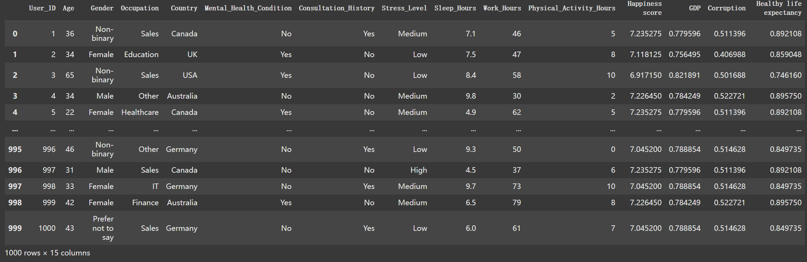
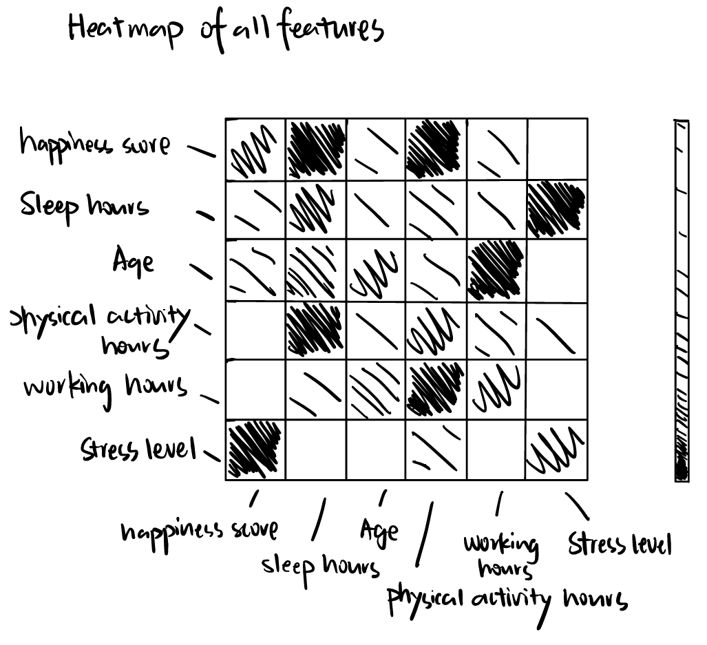
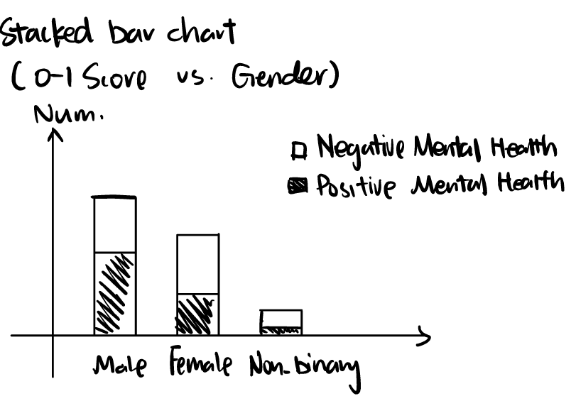
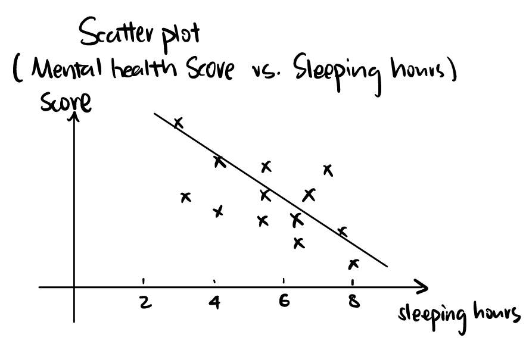
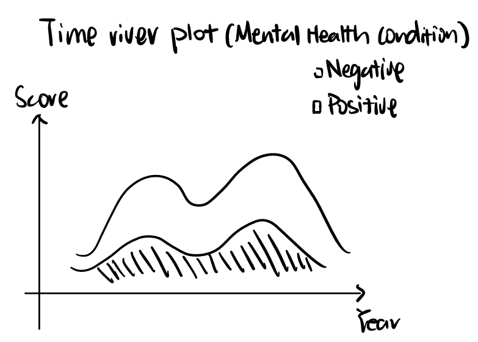
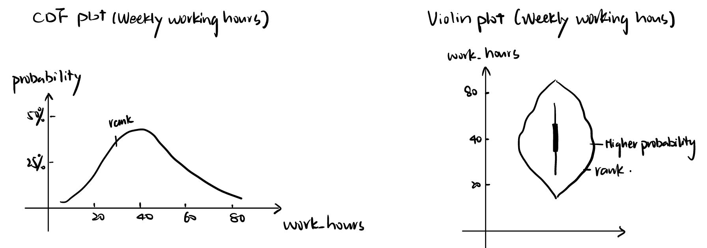
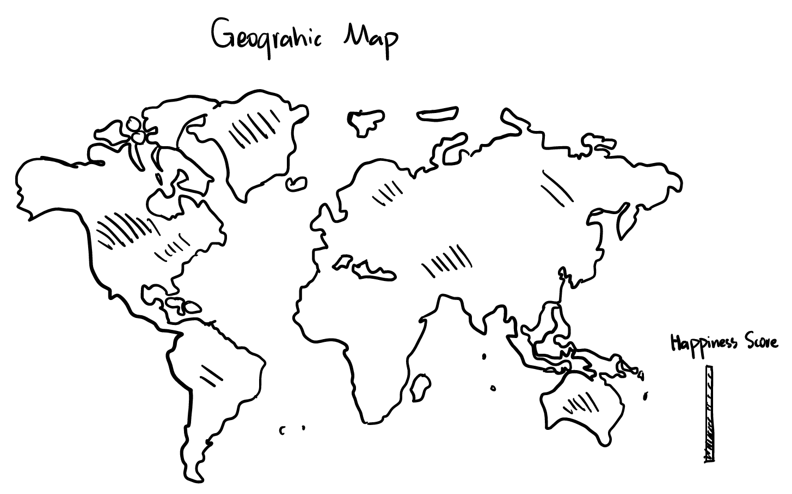

# Final Project Proposal

**GitHub Repo URL**: https://github.com/CMU-IDS-Fall-2024/final-project-f24-superawesometeamname

Group members: Aijia Lei, Shanru Lin, Xueqi Li, Yibo Kong

05839-A Interactive Data Science

Nov 6, 2024
update: Nov 13, 2024

## Research Question
How Can Adults Assess Their Mental Health Using Socioeconomic and Psychological Factors?

## Problem Description
In today's fast-paced life, it has become more important than ever to focus on one's mental health. Everyone is facing unique challenges: pressures from work, family, society, and even global changes. We all want to find balance and achieve inner peace in our lives, yet many people suffer a huge burden on their mental health for a variety of reasons. 

This study aims to empower individuals to improve their psychological state by highlighting how daily behaviors—like sleep and activity-and broader and potential socioeconomic factors, such as occupation and country-level conditions-like GDP per capita, social support, and government governance-impact mental well-being. By understanding these influences, we hope to enable adults to better assess and improve their mental health through informed, actionable insights.

Technically, our research aims to identify key factors that influence mental health using visualization techniques and develop a machine-learning model that can predict an individual’s mental health status based on information provided by the user. Ultimately, a Streamlit interface is expected to be developed and used to demonstrate the findings of this project.

## Solution
To answer the above research question, our group proposes the following pipeline as our solution:
- Data Integration:
  
    Merge personal lifestyle data with national-level indicators (e.g., happiness scores, GDP) for a holistic view of mental health factors.
- Exploratory Data Analysis and Visualization:
  
    Conduct visual analyses using tools like Streamlit and Altair, to identify relationships between mental health, lifestyle factors (e.g., sleep, stress), and socioeconomic indicators.
- Predictive Model:
  
    Build and evaluate a machine learning model to predict mental health status based on individual and environmental factors.
- Interpretability and Insights:
  
    Identify key risk factors from the model to make predictions interpretable and actionable.
- Self-Assessment Tool:
  
    Develop an interactive prototype for users to assess mental health risks by entering personal and socioeconomic data, fostering awareness and self-diagnosis.

## Dataset and Data Source

<ins>Main Dataset</ins>

The [Mental Health Dataset][1] is selected as the main dataset. It provides a collection of anonymized mental health data for 1000 individuals, representing a wide range of ages, genders, occupations, and countries. It aims to shed light on the various factors affecting mental health, offering valuable insights into sleep patterns, work-life balance, and physical activity.
Key features include: 
Demographics: country, age, gender, and occupation
Lifestyle Factors: sleep duration, work hours per week, and weekly physical activity hours
Self-reported mental health conditions: stress levels and consultation history.

<ins>Supplemental Dataset</ins>

The [World Happiness Report][2] is chosen as an additional data source to augment our data and support our project. We will merge the happiness score for each country, as provided by this dataset, with our main dataset on the "Country" column to examine correlations between happiness scores and mental health trends. This enriched dataset will allow us to address questions about how societal well-being influences individual mental health outcomes.

[1]: https://www.kaggle.com/datasets/bhadramohit/mental-health-dataset/data
[2]: https://www.kaggle.com/datasets/mathurinache/world-happiness-report?select=2022.csv

# Update on Nov 13, 2024

## Data Processing
Steps: 
- Table 1 (Mental health)
   - Delete  Severity
- Table 2 (Happiness)
  - Delete year 2015 and 2022 (bc different score scale and format); 
  - For year 2016-2021, match column names across tables of different years; 
  - Keep only col of country, happiness score /  ladder score, GDP per capita, health, trust / corruption
  - Normalize all cols of all valid year
  - Join tables (make sure country names are same) then drop NAN 

To check the code and the processed data, please refer to [the Jupyter notebook](./Data/data_processing.ipynb)

## Data Visualization/Sketches
We propose to add the following plots in our app:
- Heatmap of all features vs. all features; choose pairs of high correlation and draw stacked bar charts (for categorical data) & Scatter plot with trendline / timeriver /  stacked bar plot (for numerical data)
  For input features, we will perform Heatmap to see the correlation between each factors:

  

  For the pairs that with high correlation, we will perform further analysis in diverse charts. For example, for categorical feature "Gender", we will perform stacked bar charts:

  

  For numerical features like "Sleeping Hours" or "Year", we will perform scatter plots and Time river plots:

  
  
  
- CDF or violin plot of each feature’s distribution.
  Examining the distribution provides a clearer view of the input variable's spread, which can also support the system's predictive functionality by presenting the ranking of a specific input value. Both CDF plots and violin plots can effectively visualize the distribution percentages:

  

  
- Geographic map (st.map) of each country, in terms of happiness score, GDP, and trust.

  

## System Design
#### Interactive data lookup
- Filters
  - Selector (for categorical data): Gender, Occupation, Country, Consultation_History, Stress_Level
  - Slider (for numerical data): Year, Age, Sleep_Hours, Physical_Activity_Hours, Work_Hours

Plots: See “Data Visualization/Sketches”
    
#### Interactive prediction
- Functionality
Our app would demonstrate an interactive feature of mental health condition prediction, in that the user could input his/her proprietary data and receive a mental health evaluation score, with visualization of this score on the violin plot of our entire dataset.
- Model
We plan to choose appropriate predictors like logistic regression, decision tree, random forest, etc.
